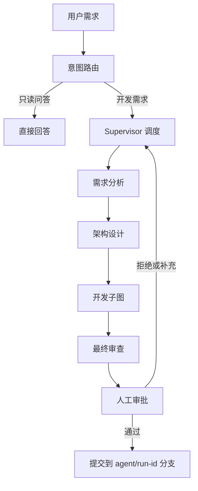

# CodeGuild

基于 LangGraph 的多 Agent 软件开发系统 —— 用自然语言描述需求，多 Agent 协作完成「需求 → 架构 → 编码 → 测试 → 审查 → 提交」闭环，关键节点由你拍板。

后端 FastAPI + LangGraph，前端 React（Vite + TypeScript + Tailwind CSS），代码变更在 Git Worktree 隔离分支中完成，审批通过前不触碰原仓库。

## 核心能力

- **意图路由**：只读提问（如「这个项目的鉴权逻辑在哪？」）直接回答，不进入开发流程；开发需求进入多 Agent 闭环。
- **多 Agent 协作**：Supervisor 调度 需求分析 / 架构设计 / 编码 / 测试 / 审查 各角色，任务 DAG 驱动，含修复循环与重试上限。
- **Agent Harness 执行层**：统一的执行循环、上下文注入、工具权限与策略（敏感路径强制审批）、失败重试、输出裁剪与观测。
- **人机协作（HITL）**：安全点打断 / 恢复（可携带补充需求）、工具调用审批（单次 / 始终允许）、交付审批（同意 / 拒绝）。
- **Git Worktree 隔离**：每次运行在独立工作区与 `agent/run-<id>` 分支进行，Diff 随时可查，原仓库零污染。
- **项目导入**：登记任意本地项目文件夹；不是 Git 仓库（或尚无提交）时可自动初始化并创建基线提交。
- **执行可观测**：SSE 事件流实时推送，任务 DAG、Agent 执行轨迹、AI 中文解说、Diff 抽屉、步数 / Token / 费用指标。
- **多模型支持**：OpenAI 兼容端点（已实测 DeepSeek）、Anthropic，以及无需 Key 的 Mock 脚本离线模式。
- **沙箱执行**：目标项目的测试命令默认在 Docker 沙箱中运行（可切换本机模式）。

## 工作流



开发子图内部：任务调度 → 编码 → 测试 → 审查 → 修复循环（受重试上限约束，超限时请求人工介入）。HITL 打断安全点设在 Supervisor 入口与任务调度器，挂起后可通过审批接口恢复并注入补充需求。

## 快速开始

环境要求：Python ≥ 3.11、Node.js ≥ 18、Git；（可选）Docker 用于沙箱执行测试。

### 1. 后端

```powershell
python -m venv .venv
.venv\Scripts\activate          # macOS / Linux: source .venv/bin/activate
pip install -e ".[dev]"
```

### 2. 配置

复制 `.env.example` 为 `.env`，至少填写 LLM 配置（例如 DeepSeek）：

```ini
LLM_PROVIDER=openai
LLM_MODEL=deepseek-chat
LLM_API_KEY=sk-...
LLM_BASE_URL=https://api.deepseek.com
```

### 3. 前端构建

```powershell
cd web
npm install
npm.cmd run build   # Windows 下必须用 npm.cmd（npm 会被执行策略拦截）
```

### 4. 启动

```powershell
.venv\Scripts\codeguild.exe serve   # 旧命令 ma-dev serve 仍兼容
```

打开 http://127.0.0.1:8000 —— 后端同时托管前端构建产物。改后端代码或重新构建 dist 后需重启进程（无热重载）。

## 使用指南

1. **导入项目**：在工作台点击「+ 导入项目」，填写项目名称与文件夹绝对路径；非 Git 文件夹可勾选「自动初始化」（执行 `git init` 并创建基线提交，不改动现有文件）。
2. **描述需求**：选中项目后输入自然语言需求；纯提问会直接得到回答，开发需求会自动进入多 Agent 闭环。
3. **观察与介入**：在运行页查看任务 DAG、Agent 执行轨迹与 AI 解说；随时可「打断」暂停并在恢复时补充需求，敏感工具调用会等待你的审批。
4. **审查交付**：通过 Diff 抽屉查看全部代码变更；批准后提交到隔离分支 `agent/run-<id>`，拒绝则终止本次运行。

## CLI 命令

| 命令 | 说明 |
| --- | --- |
| `codeguild serve` | 启动后端服务（托管前端） |
| `codeguild project-add` | 注册项目（本地 Git 仓库） |
| `codeguild run` | 发起一次开发运行（`--watch` 实时观察） |
| `codeguild watch` | 观察运行事件流（SSE） |
| `codeguild status` | 查看运行状态与指标 |
| `codeguild tasks` | 查看任务 DAG 状态 |
| `codeguild diff` | 查看代码变更 |
| `codeguild approve` | 提交人工审批（approve / reject / continue） |
| `codeguild sandbox-build` | 构建推荐沙箱镜像（含 pytest） |

## 主要配置项

| 变量 | 默认值 | 说明 |
| --- | --- | --- |
| `LLM_PROVIDER` | `openai` | `openai`（兼容 DeepSeek 等）/ `anthropic` / `mock` |
| `LLM_MODEL` | `gpt-4o-mini` | 全局模型；可按 Agent 用 `LLM_MODEL_OVERRIDES` 覆盖 |
| `LLM_API_KEY` / `LLM_BASE_URL` | 空 | API Key 与兼容端点 |
| `MOCK_SCRIPTS_FILE` | 空 | Mock 模式脚本文件（离线联调 / 演示，无需 Key） |
| `SANDBOX_MODE` | `docker` | `docker` / `local` |
| `SANDBOX_IMAGE` | `multi-agent-sandbox:py312` | 沙箱镜像（由 `codeguild sandbox-build` 构建） |
| `TEST_COMMAND` | `python -m pytest -q` | 目标项目的测试命令 |
| `DATA_DIR` | `./data` | 运行时数据（数据库 / 会话 / 工作区 / 产物） |

Mock 模式协议：`single` 路由类 Agent 直接返回原始 schema JSON；`agentic` 类 Agent 使用 decision 协议（`{"decision":"tool_call","tool":"read_file","arguments":{...}}` 或 `{"decision":"final","output":{...}}`）。

## 项目结构

```
app/
  agents/      各角色 Agent（product / architect / coder / tester / reviewer / supervisor / analyst）
  api/         FastAPI 路由（projects / runs / approvals / artifacts）
  graph/       LangGraph 主图、开发子图、HITL 安全点、路由
  harness/     执行循环 / 权限 / 策略 / 审批 / 重试 / guidance / 观测
  memory/      工作记忆 / 项目记忆 / 长期记忆
  retrieval/   BM25 + 符号检索（代码 RAG）
  sandbox/     Docker 沙箱执行
  services/    运行生命周期与审批提交
  storage/     SQLAlchemy 模型与仓储（SQLite）
  tools/       文件系统 / Shell / Git / 检索 / 控制工具
  workspace/   Git Worktree 隔离工作区
web/           React + TypeScript + Tailwind 前端（Vite）
tests/         pytest 测试（Mock LLM 脚本驱动，含 HITL / 工具 / 图流程）
docs/          设计方案与需求报告书
data/          运行时数据（勿删）
sandbox/       沙箱镜像 Dockerfile
```

## 开发与测试

```powershell
# 后端测试（basetemp=.pytest_tmp，自动清空重建；Mock LLM 无需 Key）
.venv\Scripts\python.exe -m pytest tests/ -q

# 前端开发（Vite dev server，端口 5173）
cd web
npm.cmd run dev

# 前端构建
npm.cmd run build
```

## 设计文档

- [基于 LangGraph 的多 Agent 软件开发系统设计方案](docs/基于%20LangGraph%20的多%20Agent%20软件开发系统设计方案.md)
- [基于 LangGraph 的多 Agent 软件开发系统需求报告书](docs/基于%20LangGraph%20的多%20Agent%20软件开发系统需求报告书.md)
