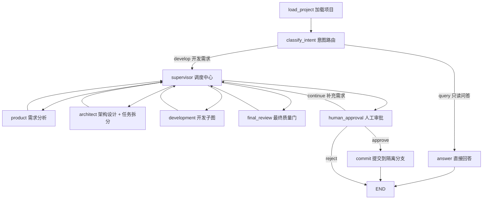
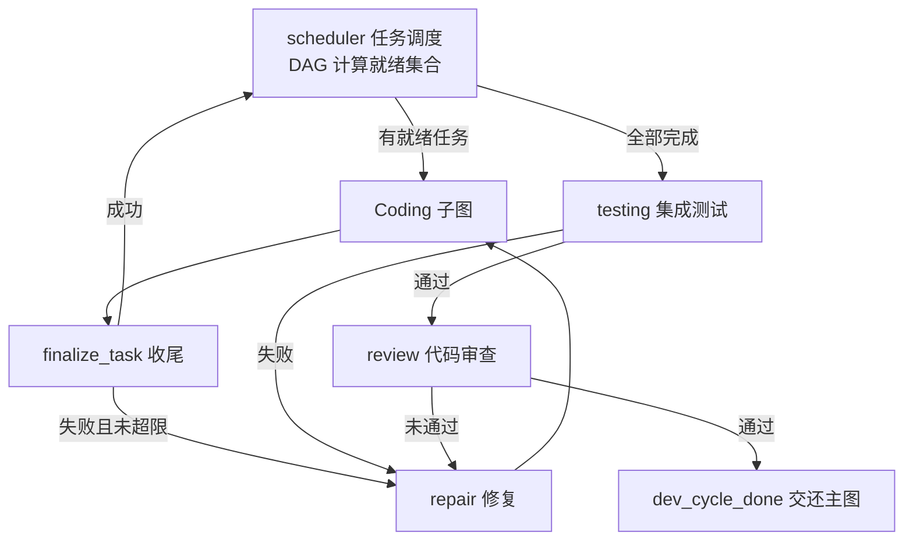

# CodeGuild 系统架构介绍

| 项目 | 内容 |
|------|------|
| 文档版本 | V1.0 |
| 文档状态 | 架构说明稿 |
| 更新时间 | 2026-09-16 |
| 项目定位 | 基于 LangGraph 的多 Agent 软件开发系统（FastAPI + React） |

---

# 1. 系统定位

CodeGuild 是一个**面向真实代码仓库的多 Agent 软件开发平台**。

用户用自然语言描述需求，系统自动完成「需求分析 → 架构设计 → 编码 → 测试 → 审查 → 人工审批 → 提交」的完整软件工程闭环，关键节点由人拍板。

系统不是"多个 LLM 按固定顺序生成文本"，而是：

> **基于共享状态、任务 DAG、动态调度、工具执行与反馈闭环的 Agent 软件工程系统。**

## 1.1 核心能力

| 能力 | 说明 |
|------|------|
| 意图路由 | 只读提问（如「鉴权逻辑在哪？」）直接回答；开发需求进入多 Agent 闭环 |
| 多 Agent 协作 | Supervisor 调度 需求 / 架构 / 编码 / 测试 / 审查 各角色，任务 DAG 驱动，含修复循环与重试上限 |
| Agent Harness 执行层 | 统一的执行循环、上下文注入、工具权限与策略（敏感路径强制审批）、失败重试、输出裁剪与观测 |
| 人机协作（HITL） | 安全点打断 / 恢复（可携带补充需求）、工具调用审批、交付审批（同意 / 拒绝 / 继续修复） |
| Git Worktree 隔离 | 每次运行在独立工作区与 `agent/run-<id>` 分支进行，Diff 随时可查，原仓库零污染 |
| 项目导入 | 登记任意本地项目文件夹；非 Git 项目可自动 `git init` 并创建基线提交 |
| 执行可观测 | SSE 事件流实时推送，任务 DAG、Agent 执行轨迹、AI 中文解说、Diff 抽屉、步数 / Token / 费用指标 |
| 多模型支持 | OpenAI 兼容端点（已实测 DeepSeek）、Anthropic、无需 Key 的 Mock 脚本离线模式 |
| 沙箱执行 | 目标项目的测试命令默认在 Docker 沙箱中运行（可切换本机模式） |

---

# 2. 总体架构

## 2.1 分层视图

```text
┌─────────────────────────────────────────────────────────────┐
│  前端展示层  web/（React + TypeScript + Tailwind，Vite 构建）  │
│  工作台 / 运行页三栏（任务 DAG | Agent 轨迹 | AI 解说）         │
│  SSE 事件流 · Diff 抽屉 · 审批面板 · 指标面板                   │
└──────────────────────────┬──────────────────────────────────┘
                           │ HTTP / SSE
┌──────────────────────────▼──────────────────────────────────┐
│  API 服务层  app/api/（FastAPI）                              │
│  projects · runs · approvals · artifacts                     │
│  RunManager：运行生命周期（启动 / 中断 / 恢复 / 收尾）           │
└──────────────────────────┬──────────────────────────────────┘
                           │
┌──────────────────────────▼──────────────────────────────────┐
│  编排层  app/graph/（LangGraph）                              │
│  Main Graph：意图路由 → Supervisor → 角色节点 → 审批 → 提交    │
│  Development SubGraph：调度 → 编码 → 测试 → 审查 → 修复循环    │
│  Coding SubGraph：领任务 → 检索上下文 → 执行 → 确定性验证       │
│  HITL 安全点：interrupt() 挂起 / Command(resume) 恢复          │
└──────────────────────────┬──────────────────────────────────┘
                           │
┌──────────────────────────▼──────────────────────────────────┐
│  Agent 层  app/agents/                                       │
│  专业化角色：analyst / product / architect / coder /           │
│  tester / reviewer / supervisor（prompts 集中管理）            │
└──────────────────────────┬──────────────────────────────────┘
                           │
┌──────────────────────────▼──────────────────────────────────┐
│  Harness 执行层  app/harness/                                 │
│  AgentRuntime 统一执行循环 · 工具注册/权限/策略 · 审批          │
│  重试 · 上下文管理 · Observation 裁剪 · 会话持久化 · guidance   │
└──────────────────────────┬──────────────────────────────────┘
                           │
┌──────────────────────────▼──────────────────────────────────┐
│  基础设施层                                                   │
│  Workspace（Git Worktree 隔离） · Sandbox（Docker 执行）       │
│  Retrieval（BM25 + 符号检索） · Memory（工作/项目/长期记忆）    │
│  Storage（SQLite） · Observability（事件总线 / Trace / 指标）  │
└─────────────────────────────────────────────────────────────┘
```

## 2.2 核心设计原则

**Orchestration 与 Execution 分离**——三个层次各司其职：

```text
LangGraph  →  决定"哪个 Agent 工作"（编排、状态流转、条件路由、中断恢复）
Agent      →  决定"当前应该做什么"（推理、规划、动作选择）
Harness    →  负责"如何安全、稳定地执行"（上下文、工具、权限、观测）
```

**其它原则**：

- **State-driven**：Agent 之间不靠自由聊天协作，通过结构化输出写入 Shared State 传递
- **Artifact-driven**：传递的是 Requirements / Architecture / Task DAG / Patch / Test Report 等软件工程产物
- **闭环优先**：编码 → 测试 → 审查 → 修复 → 再测试，不允许"生成代码即结束"
- **最小权限**：工具调用经权限画像 + 策略引擎判定，敏感路径强制人工审批
- **隔离执行**：所有代码变更发生在 Git Worktree 独立分支，审批通过前不触碰原仓库

---

# 3. 技术栈

| 分类 | 技术 |
|------|------|
| 编排 | LangGraph（StateGraph / Conditional Edge / interrupt / Checkpointer） |
| 后端 | Python ≥ 3.11 · FastAPI · Pydantic v2 · SQLAlchemy（SQLite） |
| LLM | OpenAI 兼容端点（DeepSeek 实测）/ Anthropic / Mock 脚本模式 |
| Agent 执行 | 原生 function calling 工具协议 + 统一 AgentRuntime 执行循环 |
| 检索 | BM25 + 符号检索（代码 RAG，为编码任务注入上下文） |
| 沙箱 | Docker（目标项目测试命令隔离执行，可切换本机模式） |
| 隔离 | Git Worktree + `agent/run-<id>` 分支 |
| 前端 | React + TypeScript + Tailwind CSS（Vite 构建，由后端托管 dist） |
| 实时 | SSE 事件流（Server-Sent Events） |
| 持久化 | SQLite（运行/任务/审批记录 + LangGraph Checkpoint） + JSON 会话文件 |

---

# 4. 代码模块结构

```text
app/
  main.py          FastAPI 入口（lifespan 装配 AppContext + RunManager；托管 web/dist SPA）
  cli.py           命令行（serve / project-add / run / watch / approve / diff 等）
  config.py        配置加载（Settings，.env）

  api/             HTTP 路由：projects / runs / approvals / artifacts / deps
  services/
    app_context.py AppContext 全局装配（Harness 全组件 + 数据库 + Checkpointer）
    run_manager.py RunManager 运行生命周期（启动 / 中断 / 恢复 / 取消 / 收尾）

  graph/           LangGraph 图定义
    main_graph.py        主图（意图路由 → Supervisor → 角色节点 → 审批 → commit）
    development_graph.py 开发子图（调度 → 编码 → 测试 → 审查 → 修复）
    coding_graph.py      编码子图（领任务 → 检索 → 执行 → 验证）
    safe_point.py        HITL 打断安全点（interrupt 挂起 / 恢复）
    routing.py           条件路由函数（主图 / 开发子图 / 编码子图）

  agents/          各角色 Agent 实现：analyst / product / architect / coder /
                   tester / reviewer / supervisor / researcher + prompts.py
  harness/         Agent Harness 执行层
    runtime.py       AgentRuntime 统一执行循环（预算 / 停止条件 / 决策协议）
    executor.py      工具执行器（权限 → 策略 → 审批 → 执行 → 观测）
    registry.py      工具注册表   permission.py 权限画像   policy.py 策略引擎
    approval.py      审批管理     retry.py 重试     context.py 上下文管理
    observation.py   输出裁剪与结构化观测     session.py 运行时会话持久化
    guidance.py      运行中人工补充需求       control.py 打断控制
    llm.py           LLM 客户端（多 provider + Mock 脚本 + 结构化输出）

  schemas/         共享数据结构：state.py（DevState / 任务 DAG 算法）/ events.py /
                   artifacts.py / tool.py
  tools/           工具实现：filesystem / shell / git / retrieval / control
  retrieval/       BM25 检索 + 符号搜索
  memory/          工作记忆 / 项目记忆 / 长期记忆
  sandbox/         Docker 沙箱执行
  workspace/       Git Worktree 隔离工作区管理
  storage/         SQLAlchemy 模型与仓储（SQLite）
  observability/   事件总线（SSE 推送）与 TraceManager（检查点 / 指标）

web/               React 前端（src/pages 两个页面 + components 组件库 + api 客户端）
tests/             pytest（Mock LLM 脚本驱动，覆盖 HITL / 工具 / 图流程）
data/              运行时数据（copilot.db / checkpoints.sqlite / sessions/ / workspaces/）
```

---

# 5. 核心流程

## 5.1 运行生命周期（RunManager）

```text
用户提交需求（POST /projects/{id}/runs）
        ↓
RunManager.start_run
  ├─ 创建运行工作区：git worktree add + 分支 agent/run-<id>
  │   （data/workspaces/{project}-run-<id>，原仓库零污染）
  ├─ 构造初始 DevState（empty_dev_state）
  └─ 后台 asyncio 任务启动 Main Graph
        ↓
  graph.ainvoke(inputs, config={thread_id: run_id})
   （Checkpointer 持久化，支持进程内中断 / 恢复）
        ↓
  遇到 interrupt() 挂起
  ├─ 记录挂起载荷（唯一 approval_id）
  ├─ 运行状态置 waiting_approval / needs_human
  └─ SSE 推送 approval_required / tool_approval / pause 事件
        ↓
  人工提交审批（POST /runs/{id}/approve）
  └─ graph.ainvoke(Command(resume=decision), config) → 从中断点继续
        ↓
  终态：completed（已提交）/ rejected / failed / cancelled
  └─ 清理控制标志、关闭事件流、落库指标
```

关键点：

- `thread_id = run_id`，Checkpointer 用 `AsyncSqliteSaver`（`data/checkpoints.sqlite`），不可用时回退内存
- 节点恢复时**从头重跑该节点**；因此状态清理（如 `clear_pause`）必须放在 `interrupt()` 返回之后，保证重放幂等
- 重复启动 / 非挂起状态提交审批会抛 `RunConflict`

## 5.2 主图流程（Main Graph）



**Supervisor 是唯一的调度中心**：所有角色节点执行完都回到 Supervisor，由它决策下一步（Conditional Edge 动态跳转）。两种模式：

- **fixed（MVP 默认）**：依据 Shared State 固定顺序判断——无 `requirements` → product；无 `architecture` → architect；`dev_cycle_done` 未完成 → development；无 `final_report` → final_review；无 `approval` → human_approval；审批通过未提交 → commit
- **dynamic（V2）**：LLM 读取状态摘要从候选集（`ALLOWED_AGENTS`）中选择，输出 `{next_agent, reason}`；失败自动回退 fixed 逻辑

**意图路由**：`classify_intent` 由 Analyst Agent 判定 `query` / `develop`；异常时保守回退到开发闭环。`query` 模式直接生成只读回答（markdown + 关键点 + 引用文件）后结束。

**最终质量门（final_review）**四项检查，全部通过才置 `ready_for_approval`：

1. 任务全部完成 2. 测试通过 3. Review 通过 4. 存在代码变更

未通过则回到开发闭环修复（失败任务重置为 PENDING），`max_code_retry` 超限后置 `needs_human` 转人工。

**commit**：审批通过后 `git add -A` + `git commit`（作者 `Multi-Agent Copilot`），提交信息形如 `feat: <需求摘要>` + run id + 完成任务列表；MVP 不自动 Push。

## 5.3 开发子图（Development SubGraph）



**任务调度器** 每次执行：

1. 依赖修复后的恢复——`BLOCKED` 任务依赖不再失败 → 回 `PENDING`
2. 阻塞传播——依赖链路出现 `FAILED/BLOCKED` → 本任务 `BLOCKED`（`propagate_blocking`）
3. 就绪计算——依赖全部 `COMPLETED` 的任务进入 `READY`（`compute_ready_tasks`）
4. 按拓扑序（`topological_order`）排出执行顺序；全部完成 → 进入 testing；无就绪且未完成 → `needs_human`

**三层修复循环与重试上限**：

| 循环 | 失败触发 | 重试计数 | 上限后行为 |
|------|----------|----------|------------|
| Coding | validate 未通过 | 子图内 1 次 + finalize 任务级 `attempts` | 任务 FAILED → repair 或转人工 |
| Test | 集成测试失败 | `retries.test`（MAX_TEST_RETRY） | needs_human |
| Review | 审查未通过 | `retries.review`（MAX_REVIEW_RETRY） | needs_human |

修复节点（repair）会把结构化失败反馈（测试失败摘要 / Review 问题清单，含文件、行号、建议）拼成 `feedback` 注入下一轮编码上下文，并选择目标任务（活动任务或拓扑序最后一个已完成任务）。

## 5.4 编码子图（Coding SubGraph）

```text
receive_task（领取任务：RUNNING / attempts+1）
    ↓
retrieve_context（BM25 + 符号检索，注入相关代码片段）
    ↓
execute（Coder Agent 在 Harness 执行循环内完成"探索 → 计划 → 编辑"，工具调用驱动）
    ↓
validate（确定性执行测试命令 run_test，结构化解析结果）
    ↓
  passed → finish（结束，交还开发子图 finalize_task）
  failed → 子图内修复 1 次（携带失败反馈重跑 execute）→ 仍失败 → failed
```

编码 Agent 的每一步（读文件、写文件、跑测试）都是**受控工具调用**：经序列化、权限画像、策略引擎（敏感路径强制审批）、执行、Observation 裁剪后回填上下文。

---

# 6. 核心设计

## 6.1 共享状态（DevState）

`DevState` 是 LangGraph 的共享状态（TypedDict），也是 Agent 间协作的**唯一事实载体**。核心字段：

| 字段 | 说明 |
|------|------|
| `requirements` / `architecture` | 需求分析与架构设计产物（含 Task DAG 拆分） |
| `task_dag` / `ready_tasks` / `completed_tasks` | 任务 DAG 与调度状态 |
| `changed_files` / `commits` | 变更文件（path/action/task_id）与提交记录 |
| `test_results` / `review_results` / `validation` | 测试、审查、编码验证结果 |
| `retries` | 分闭环重试计数 `{code, test, review, plan}` |
| `final_report` | 最终质量门汇总（含 blockers） |
| `needs_human` / `fail_reason` | 人工介入标志与原因 |
| `scratch` | 子图内部暂存（检索上下文 / 修复反馈 / 编码结果） |
| `artifacts` | 大产物引用制（只存文件路径，防状态膨胀） |

**防膨胀约定**：大型产物（需求、架构、报告）只保存 artifact 文件引用；节点内对 `errors` 等列表字段读改写而非多写，避免子图 reducer 双写冲突。

**任务状态机**：`PENDING → READY → RUNNING →（REVIEWING →）COMPLETED`，异常分支 `FAILED`（重试超限）/ `BLOCKED`（依赖失败传播）。

**DAG 工具函数**（`schemas/state.py`）：`validate_task_dag`（id 唯一 / 依赖存在 / DFS 环检测）、`compute_ready_tasks`、`propagate_blocking`、`topological_order`。

## 6.2 Harness 执行层

所有 Agent 共用同一套 Harness（不重复实现），统一执行循环：

```text
Build Context → Model Call → Decision → Tool Call → Observation → …（循环）
                                      ↓
                              Final Decision（结构化输出）
```

| 组件 | 职责 |
|------|------|
| `AgentRuntime` | 执行循环、停止条件（步数 / Token / 费用 / 墙钟 / 失败率）、决策协议 |
| `ToolExecutor` | 工具执行管线：权限 → 策略 → 审批 → 沙箱执行 → Observation |
| `PermissionManager` | 按 Agent 权限画像限定可调用工具集 |
| `PolicyEngine` | 路径 / 命令策略，敏感操作强制审批 |
| `ApprovalManager` | 审批模式（interactive / auto）、审批记录留痕 |
| `ContextManager` | 系统提示 + 任务简报 + 记忆摘录 + guidance 组装 |
| `ObservationAdapter` | 大输出裁剪（文件读取、命令输出结构化摘要） |
| `RetryManager` | 工具级失败重试（指数退避） |
| `RuntimeSession` | 会话持久化（`data/sessions/`），审批中断恢复不重复已完成的工具调用 |
| `GuidanceManager` | 运行中人工补充需求，注入后续所有轮次 |

**执行段预算**：对话记忆（messages / plan / changed_files）跨执行段保留；预算计数器（steps / tokens / cost / tool_failures / 墙钟）按执行段管理——上一段结束（finished / stopped / failed）后再次执行时重置，审批恢复（awaiting_approval）属同一执行段仅刷新墙钟。避免"token 到顶 / 轮次上限后继续迭代立即判停"。

**工具协议**：原生 function calling（OpenAI 兼容 `tools` / `tool_calls`），assistant 的 `tool_calls` 与 tool 结果消息严格按 `tool_call_id` 配对，兼容 DeepSeek / OpenAI 严格校验。

## 6.3 HITL 人机协作

三种介入方式，所有挂起载荷都带**唯一 `approval_id`**（前端据此复位审批面板，同一工具多次请求、多次打断时不刷新页面也能正常操作）：

| 方式 | 触发 | 挂起载荷 | 恢复选项 |
|------|------|----------|----------|
| 打断（pause） | 用户任意时刻请求，在图的下一个安全点挂起 | `type=pause`，含当前 Agent | `resume`（可携带补充需求注入 guidance）/ `reject`（取消运行） |
| 工具审批 | 敏感工具调用（写文件、执行命令等） | `type=tool_approval`，含工具名、参数摘要、策略原因 | interactive：`approve_once` / `approve_always` / `reject`；auto：`approve` / `reject` |
| 交付审批 | 最终质量门通过或重试超限 | `type=approval_required`，含 Diff 摘要、测试失败、Review 问题、blockers | `approve`（提交）/ `reject`（终止）/ `continue`（追加需求继续修复，超限时提供） |

**打断安全点**设在两处：Supervisor 调度前与任务调度器入口——保证打断发生在任务边界，不破坏执行中的工具调用。

**恢复语义**：

- 打断恢复的 note / 交付审批 `continue` 的 note → 写入 guidance，下一轮修复自动携带
- `continue` 同时重置失败/阻塞任务与重试计数，回到开发闭环
- `reject` → 运行状态 `rejected`，流程终止
- interrupt 恢复后先清标志再继续（重放幂等）

## 6.4 Git Worktree 隔离

```text
原仓库（用户工作区，零污染）
   │  git worktree add
   ▼
data/workspaces/{project}-run-<id>   ← 此次运行的独立工作区
   分支：agent/run-<id>               ← 基线 = 原仓库当前分支
```

- **项目导入**：`ensure_repo_ready` 支持非 Git 文件夹自动 `git init` + 基线提交（基线提交必须非 Agent 作者，避免被 diff 基线逻辑误排除）；位于外层仓库内部的文件夹会初始化为独立新仓库
- **Diff 展示**：优先 `git diff HEAD`（含未跟踪新文件）；工作区已干净（提交后）回退展示「本分支相对基线」的累计 diff，提交后仍可回顾
- **提交**：作者 `Multi-Agent Copilot <copilot@local>`，提交信息 `feat: <摘要>` + run id + 完成任务列表
- **清理**：同名残留 worktree 自动清理后重建；completion 后可 `remove_worktree` 回收

## 6.5 可观测性

- **事件总线 + SSE**：`GET /runs/{id}/events` 推送全量事件——运行开始、Supervisor 决策、任务就绪/开始/完成/失败、修复、验证结果、Diff 就绪、审批请求/结果、打断/恢复、提交完成、错误等
- **TraceManager**：关键节点检查点落库（load_project / supervisor / …），运行指标（步数 / Token / 费用 / 墙钟 / 工具失败率）
- **前端三栏运行页**：任务 DAG（纵向）| Agent 执行轨迹 | AI 解说·交流；Diff 为右上角抽屉；`lib/narrative.ts` 把事件模板翻译成中文叙述

---

# 7. API 接口一览

| 方法与路径 | 说明 |
|-----------|------|
| `POST /projects` | 注册项目（可选自动初始化 Git 仓库） |
| `GET /projects` / `GET /projects/{id}` | 项目列表 / 详情 |
| `POST /projects/{id}/runs` | 创建运行（mode：auto / query / develop） |
| `GET /runs/{id}` / `GET /runs/{id}/state` | 运行详情 / 图状态快照 |
| `GET /runs/{id}/events` | SSE 事件流（实时推送） |
| `GET /runs/{id}/tasks` | 任务 DAG 状态 |
| `GET /runs/{id}/diff` | 代码变更（stat / full） |
| `GET /runs/{id}/metrics` | 运行指标（步数 / Token / 费用） |
| `POST /runs/{id}/approve` | 提交审批（approve / reject / continue，含 note） |
| `GET /runs/{id}/approvals` | 审批历史留痕 |
| `POST /runs/{id}/pause` / `POST /runs/{id}/resume` | 打断 / 恢复（恢复可携带补充需求） |
| `POST /runs/{id}/cancel` | 取消运行 |
| `POST /runs/{id}/guidance` / `GET .../guidance` | 补充需求提交 / 查询 |
| `POST /runs/{id}/approval_mode` | 切换工具审批模式（interactive / auto） |
| `GET /runs/{id}/artifacts` / `GET .../artifacts/{name}` | 产物列表 / 内容 |

---

# 8. 前端架构

```text
web/src/
  App.tsx            路由：/ 工作台（ProjectsPage）· /run/:id（RunPage）
  pages/             ProjectsPage（导入项目 / 发起运行 / 历史） · RunPage（三栏运行工作台）
  components/        TaskDag · EventTrace · NarrativeChat · ApprovalPanel · ApprovalHistory
                     DiffViewer · MetricsPanel · ArtifactViewer / ArtifactRenderers
                     RunHeader · TaskDetail · ThemeToggle · badges
  lib/               narrative（事件 → 中文叙述模板）· timeline · format · theme · monaco
  api/               client（fetch 封装）· hooks（useRun / useEvents 等）· types（契约类型）
```

- 后端生产模式托管 `web/dist` 并做 SPA 回退（`/run/xxx` 直接访问 / 刷新可用）；`index.html` 不做强缓存
- 运行页数据全部来自 SSE 事件流 + REST 快照，终态后忽略缓存的 `pending_approval`（避免底部面板残留）

---

# 9. 数据与存储

| 存储 | 位置 | 内容 |
|------|------|------|
| SQLite 主库 | `data/copilot.db` | 项目 / 运行 / 任务 / 审批记录 / 指标 |
| LangGraph Checkpoint | `data/checkpoints.sqlite` | 图状态持久化（中断恢复基础） |
| 运行会话 | `data/sessions/{run_id}/*.json` | Agent 会话（对话记忆 + 预算计数器），审批中断恢复不重复工具调用 |
| 工作区 | `data/workspaces/` | 每次运行的 Git Worktree |
| 产物 | `data/artifacts/{run_id}/*.json` | 需求 / 架构 / 最终报告等大产物（状态只存引用） |

---

# 10. 关键配置项

| 变量 | 默认值 | 说明 |
|------|--------|------|
| `LLM_PROVIDER` | `openai` | `openai`（兼容 DeepSeek 等）/ `anthropic` / `mock` |
| `LLM_MODEL` | `gpt-4o-mini` | 全局模型；可按 Agent 用 `LLM_MODEL_OVERRIDES` 覆盖 |
| `LLM_API_KEY` / `LLM_BASE_URL` | 空 | API Key 与兼容端点 |
| `MOCK_SCRIPTS_FILE` | 空 | Mock 模式脚本文件（离线联调 / 演示，无需 Key） |
| `SUPERVISOR_MODE` | `fixed` | `fixed` 固定顺序 / `dynamic` LLM 动态路由 |
| `MAX_CODE_RETRY` / `MAX_TEST_RETRY` / `MAX_REVIEW_RETRY` | `3` | 各闭环重试上限（超限转人工介入） |
| `SANDBOX_MODE` | `docker` | `docker` / `local` |
| `SANDBOX_IMAGE` | `multi-agent-sandbox:py312` | 沙箱镜像（`codeguild sandbox-build` 构建） |
| `TEST_COMMAND` | `python -m pytest -q` | 目标项目的测试命令 |
| `DATA_DIR` | `./data` | 运行时数据根目录 |

**Mock 模式协议**（测试 / 离线演示）：`single` 路由类 Agent 直接返回原始 schema JSON（如意图路由 `{"intent":"query",...}`）；`agentic` 类 Agent 使用 decision 协议——`{"decision":"tool_call","tool":"read_file","arguments":{...}}` 或 `{"decision":"final","output":{...}}`。

---

# 11. 设计亮点与关键约定

1. **编排 / 执行分离**：LangGraph 只管"谁干活"，Harness 只管"怎么安全地干"，Agent 只负责各自专业决策——三层可独立演进、独立测试
2. **状态驱动而非聊天驱动**：Agent 间通过 Shared State + 结构化产物协作，全程可审计、可恢复
3. **HITL 三闸门**：打断（过程控制）→ 工具审批（安全控制）→ 交付审批（结果控制），覆盖运行全生命周期
4. **恢复幂等**：interrupt 挂起载荷唯一 `approval_id`；重放时状态清理放在 `interrupt()` 返回之后
5. **执行段预算**：会话记忆跨段保留、预算按段重置，支持"继续迭代"而不触发误判停
6. **零污染交付**：Worktree 隔离 + 审批前不接触原仓库 + 提交到独立分支 + Diff 随时可查
7. **可离线交付演示**：Mock 脚本模式全流程无需 API Key，pytest 测试全部基于 Mock LLM 驱动

---

*本文档描述当前代码实现（MVP 阶段）的架构全貌。更细的需求条目与设计决策参见 [设计方案](基于%20LangGraph%20的多%20Agent%20软件开发系统设计方案.md) 与 [需求报告书](基于%20LangGraph%20的多%20Agent%20软件开发系统需求报告书.md)。*
